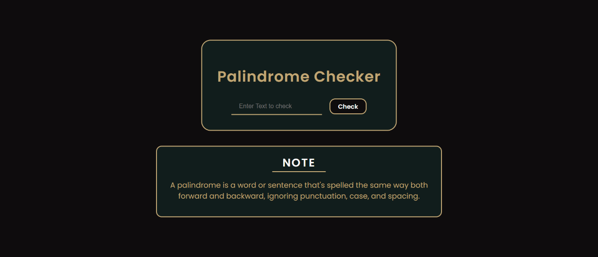

This is a solution to the [Freecodecamp certification project](https://www.freecodecamp.org/learn/javascript-algorithms-and-data-structures-v8/build-a-palindrome-checker-project/build-a-palindrome-checker).

## Table of contents

- [Overview](#overview)
  - [Screenshot](#screenshot)
  - [Links](#links)
- [My process](#my-process)
  - [Built with](#built-with)
  - [What I learned](#what-i-learned)
  - [Continued development](#continued-development)
- [Author](#author)

## Overview

### Screenshot

### Links

- Live Site URL: [https://palindromecheckerapp.netlify.app/](https://palindromecheckerapp.netlify.app/)

## My process

### Built with

- Semantic HTML5 markup
- CSS custom properties
- Flexbox
- Responsive website

### What I learned

In this project i have learned to write clean code and improved in using git and githb also. I also learned to improve my debugging skill and i will improve furthur more.

### Continued development

I want to continue focusing on writing clean code and getting different javascript knowledge and making the web more responsive and easily understandable by user. I also want to continue focusing my styling more and more appealing

## Author

- GitHub - [@Sudipkhatri036](https://github.com/SudipKhatri036)
- Frontend Mentor - [@Sudipkhatri036](https://www.frontendmentor.io/profile/SudipKhatri036)
- Linkedin - [@Sudip khatri](https://www.linkedin.com/in/sudip-khatri-a72a6a27b/)
